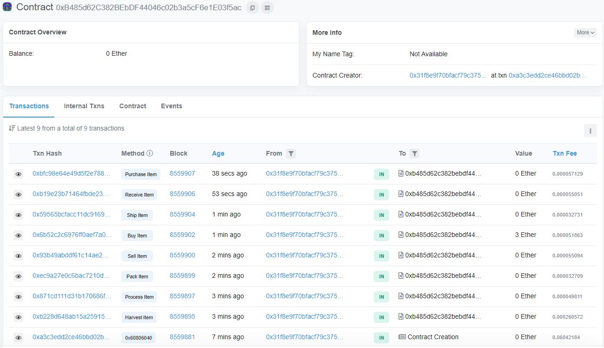
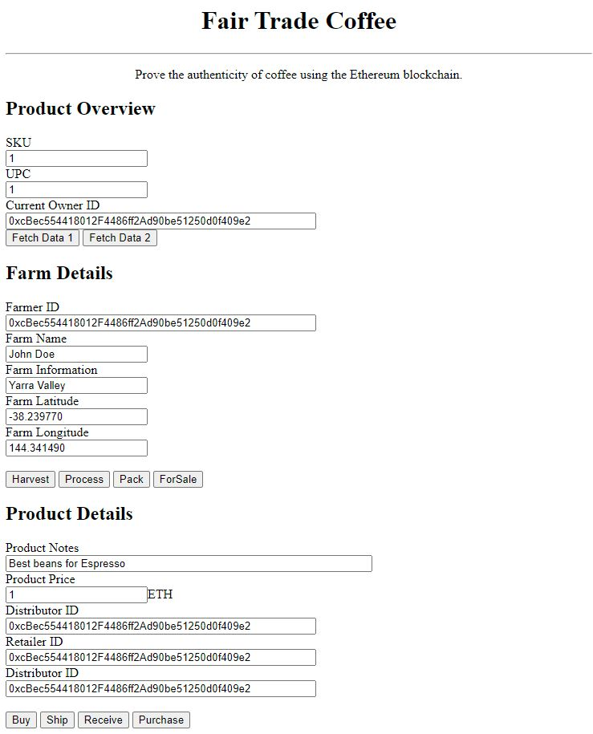
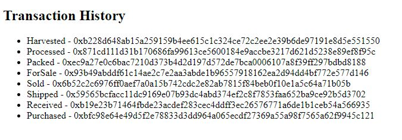
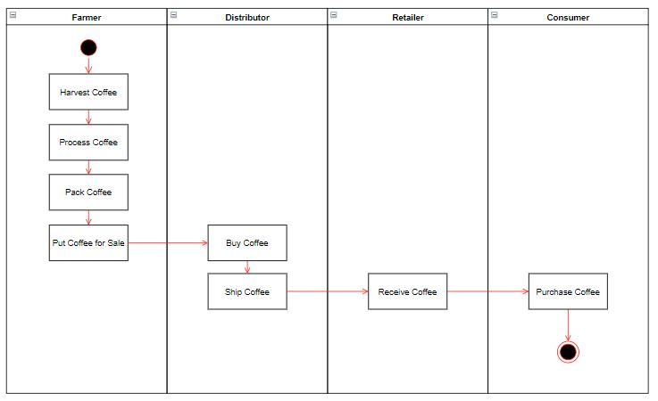
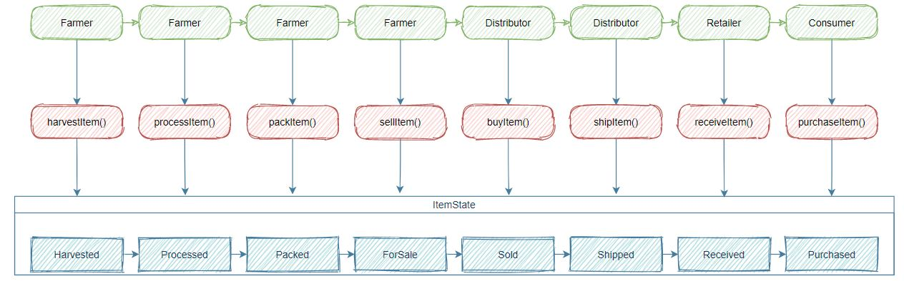
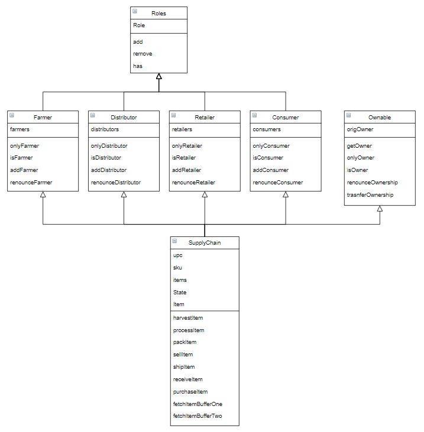

# Supply Chain & Data Auditing

This repository contains an Ethereum DApp that demonstrates a Supply Chain flow between a Seller and Buyer. The user story is similar to any commonly used supply chain process. A Seller can add items to the inventory system stored in the blockchain. A Buyer can purchase such items from the inventory system. Additionally a Seller can mark an item as Shipped, and similarly a Buyer can mark an item as Received.

An example of the SupplyChain smart contract with interactions deployed on the Rinkeby test network can be found [here](https://rinkeby.etherscan.io/address/0xb485d62c382bebdf44046c02b3a5cf6e1e03f5ac).



The DApp User Interface when running should look like...



The transaction history on the smart contract located below the GUI is used for traceability, audit and authenticity verification of the product:




## Supply Chain: key parts explained through diagrams
### Activity Diagram

### Sequence Diagram

### State Diagram

### Class Model


## Getting Started

These instructions will get you a copy of the project up and running on your local machine for development and testing purposes. See deployment for notes on how to deploy the project on a live system.

### Prerequisites

Please make sure you've already installed ganache-cli, Truffle and enabled MetaMask extension in your browser.


### Installing

A step by step series of examples that tell you have to get a development env running

Clone this repository:

```
git clone https://github.com/lorenzolucido/BlockchainND-SupplyChainDAPP.git
```

Change directory to ```BlockchainND-SupplyChainDAPP``` folder and install all requisite npm packages (as listed in ```package.json```):

```
cd BlockchainND-SupplyChainDAPP
npm install
```

### Dependencies
- `truffle` v5.3.4
- `truffle-hd-wallet` (+ Infura, used to facilitate deployment to Rinkeby testnet)
- `web3` (for browser interaction with Metamask)
- `webpack` (for bundling javascript code into modules)

1. **Node and NPM** installed - NPM is distributed with [Node.js](https://www.npmjs.com/get-npm)
```bash
# Check Node version
node -v
# Check NPM version
npm -v
```


2. **Truffle v5.3.4** - A development framework for Ethereum. 
```bash
# Unsinstall any previous version
npm uninstall -g truffle
# Install
npm install -g truffle
# Specify a particular version
npm install -g truffle@5.3.4
# Verify the version
truffle version
```


2. **Metamask: 5.3.1 or above** - If you need to update Metamask just delete your Metamask extension and install it again.


3. [Ganache](https://www.trufflesuite.com/ganache) - Make sure that your Ganache and Truffle configuration file have the same port.


4. **Other mandatory packages**:
```bash
cd app
# install packages
npm install --save  truffle-hdwallet-provider@1.0.17
npm install webpack-dev-server -g
npm install web3
```


### Run the application
1. Clean the frontend 
```bash
cd app
# Remove the node_modules  
# remove packages
rm -rf node_modules
# clean cache
npm cache clean
rm package-lock.json
# initialize npm (you can accept defaults)
npm init
# install all modules listed as dependencies in package.json
npm install
```


2. Start Truffle by running
```bash
# For starting the development console
truffle develop

# For compiling the contract, inside the development console, run:
compile

# For migrating the contract to the locally running Ethereum network, inside the development console
migrate --reset

# For running unit tests the contract, inside the development console, run:
test
```

All tests should pass as shown below:


3. Frontend - Once you are ready to start your frontend, run the following from the app folder:
```bash
cd app
npm run dev
```

## Built With

* [Ethereum](https://www.ethereum.org/) - Ethereum is a decentralized platform that runs smart contracts
* [Truffle Framework](http://truffleframework.com/) - Truffle is the most popular development framework for Ethereum with a mission to make your life a whole lot easier.


## Acknowledgments

* Solidity
* Ganache-cli
* Truffle
